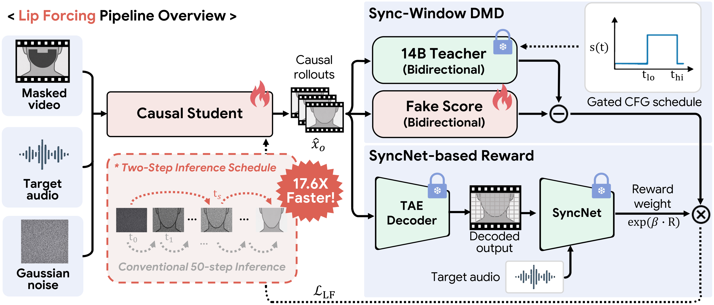

<p align="center">
  <h1 align="center">Lip Forcing: Few-Step Autoregressive Diffusion for Real-time Lip Synchronization</h1>

  <p align="center">
    <a href="https://github.com/cvlab-kaist/LipForcing">Paul&nbsp;Hyunbin&nbsp;Cho<sup>1*</sup></a> ·
    <a href="https://github.com/cvlab-kaist/LipForcing">Jinhyuk&nbsp;Jang<sup>1*</sup></a> ·
    <a href="https://github.com/cvlab-kaist/LipForcing">SeokYoung&nbsp;Lee<sup>1</sup></a> ·
    <a href="https://github.com/cvlab-kaist/LipForcing">Joungbin&nbsp;Lee<sup>1</sup></a> ·
    <a href="https://github.com/cvlab-kaist/LipForcing">Siyoon&nbsp;Jin<sup>1</sup></a> ·
    <a href="https://github.com/cvlab-kaist/LipForcing">Heeseong&nbsp;Shin<sup>1</sup></a> ·
    <a href="https://github.com/cvlab-kaist/LipForcing">Jung&nbsp;Yi<sup>1</sup></a> ·
    <a href="https://github.com/cvlab-kaist/LipForcing">Yunjin&nbsp;Park<sup>2</sup></a> ·
    <a href="https://github.com/cvlab-kaist/LipForcing">Chulmin&nbsp;Park<sup>2</sup></a> ·
    <a href="https://github.com/cvlab-kaist/LipForcing">Seungryong&nbsp;Kim<sup>1&dagger;</sup></a>
  </p>

  <p align="center">
    <sup>1</sup> KAIST&nbsp;AI ·
    <sup>2</sup> AIPARK
  </p>

  <p align="center" style="font-size: 0.9em; color: gray;">
    <sup>*</sup> Equal&nbsp;contribution. <sup>&dagger;</sup> Corresponding&nbsp;author.
  </p>

  <h3 align="center">
    <a href="https://arxiv.org/abs/2606.11180">Paper</a> |
    <a href="https://cvlab-kaist.github.io/LipForcing/">Project Page</a> |
    <a href="https://huggingface.co/JinhyukJang/lipforcing">Checkpoints</a>
  </h3>
</p>

<p align="center"></p>

---

## News

- **2026-07-07** · Initial release - 14B student weights + inference & training code.
- **2026-06-09** · Paper released on [arXiv](https://arxiv.org/abs/2606.11180).

## Roadmap

- [x] 14B student weights
- [x] Inference code
- [x] Training code
- [x] Paper on arXiv
- [ ] 1.3B student weights
- [ ] Gradio / Hugging Face Space demo

## Overview

**Lip Forcing** is, to our knowledge, the **first autoregressive diffusion method for video-to-video (V2V)
lip synchronization**. It distills a high-fidelity **bidirectional 14B audio-conditioned teacher**
(*OmniAvatar-LS*, our lip-sync finetune of [OmniAvatar](#acknowledgements)) into **causal few-step
students** that generate each chunk in just **two denoising steps with no inference-time CFG** - enabling
**real-time, streaming** lip-sync on a reference video with **sub-millisecond time-to-first-frame**.

## Highlights

- **Real-time.** The **1.3B** student runs at **31 FPS** - **17.6× faster** than its same-scale
  bidirectional teacher, crossing the 25 FPS real-time threshold.
- **Scales up.** The **14B** student (the largest diffusion model reported for V2V lip-sync) runs
  **39.8× faster** than its teacher at comparable reference fidelity.
- **Sub-millisecond time-to-first-frame** at both scales - streaming, decode-as-you-go output.
- Both scales sit on the **throughput–FVD Pareto frontier**, ahead of prior diffusion lip-sync methods.

## Installation

```bash
conda create -y -n lipforcing python=3.12 && conda activate lipforcing
git clone https://github.com/cvlab-kaist/LipForcing.git
cd LipForcing
pip install -e .
```
Optional: install `flash-attn` for faster attention (the student falls back to standard attention without it).

> **Tested on:** Ubuntu 24.04 · Python 3.12 · PyTorch 2.10.0 (CUDA 12.8) · NVIDIA H200 (driver 570.86).
> Training used 4× H200; inference runs on a single GPU.

## Weights

The released **14B student is a single self-contained file** - base Wan and the OmniAvatar-LS adapter are
merged in. **Inference** needs only the student checkpoint plus the external components (Wan VAE,
wav2vec, UMT5-XXL text encoder or precomputed embeddings, TAEW, mouth mask); the teacher and base
diffusion model are needed only for **training**.

**Lip Forcing checkpoints** - [`JinhyukJang/lipforcing`](https://huggingface.co/JinhyukJang/lipforcing):

| File | What | For |
|------|------|-----|
| `lipforcing_14b.pth` | 14B student - merged, self-contained | inference |
| `teacher/omniavatar_ls_14b.pt` | OmniAvatar-LS 14B V2V teacher | training |
| *1.3B student* | *coming soon (same repo)* | |

**Download everything for inference** (into `./weights`, matching the example commands below):

```bash
# Lip Forcing 14B student (merged, self-contained)
hf download JinhyukJang/lipforcing lipforcing_14b.pth --local-dir weights

# Wan 2.1 VAE + UMT5-XXL text encoder (+ tokenizer)
hf download Wan-AI/Wan2.1-T2V-14B Wan2.1_VAE.pth models_t5_umt5-xxl-enc-bf16.pth \
  google/umt5-xxl/special_tokens_map.json google/umt5-xxl/spiece.model \
  google/umt5-xxl/tokenizer.json google/umt5-xxl/tokenizer_config.json \
  --local-dir weights/Wan2.1-T2V-14B

# wav2vec2 audio encoder
hf download facebook/wav2vec2-base-960h --local-dir weights/wav2vec2-base-960h

# TAEW tiny decoder + LatentSync mouth mask
curl -L -o weights/taew2_1.pth https://raw.githubusercontent.com/madebyollin/taehv/main/taew2_1.pth
curl -L -o weights/mask.png https://raw.githubusercontent.com/bytedance/LatentSync/main/latentsync/utils/mask.png
```

**Additionally for training:**

```bash
# base Wan 2.1 T2V 14B diffusion shards
hf download Wan-AI/Wan2.1-T2V-14B --include "diffusion_pytorch_model*" --local-dir weights/Wan2.1-T2V-14B
# OmniAvatar-LS teacher
hf download JinhyukJang/lipforcing teacher/omniavatar_ls_14b.pt --local-dir weights
# SyncNet (Re-DMD reward)
curl -L -o weights/syncnet_v2.model https://www.robots.ox.ac.uk/~vgg/software/lipsync/data/syncnet_v2.model
```

**External models** - not redistributed here; download from the sources below:

| Model | For | Source |
|-------|-----|--------|
| Wan2.1-T2V-14B (incl. Wan VAE + UMT5-XXL) | base diffusion (train) · VAE `--vae_path` · text encoder | [Wan-AI/Wan2.1-T2V-14B](https://huggingface.co/Wan-AI/Wan2.1-T2V-14B) |
| wav2vec2-base-960h | audio encoder `--wav2vec_path` | [facebook/wav2vec2-base-960h](https://huggingface.co/facebook/wav2vec2-base-960h) |
| TAEW `taew2_1.pth` | fast tiny VAE decoder `--taehv_ckpt` (streaming + reward) | [github.com/madebyollin/taehv](https://github.com/madebyollin/taehv/blob/main/taew2_1.pth) |
| LatentSync `mask.png` | mouth mask `--mask_path` | [bytedance/LatentSync - `latentsync/utils/mask.png`](https://github.com/bytedance/LatentSync/blob/main/latentsync/utils/mask.png) |
| SyncNet-v2 `syncnet_v2.model` | SyncNet reward (training) | [joonson/syncnet_python](https://github.com/joonson/syncnet_python) (`download_model.sh`) |
| InsightFace `buffalo_l` | face detect/align (default preprocessing) | auto-downloaded by `insightface` into `checkpoints/auxiliary/` on first use |

See [DATA.md](DATA.md) for the data format, on-the-fly preprocessing, and how the training configs wire these in.

## Inference

```bash
python scripts/inference/inference_streaming.py \
  --ckpt_path weights/lipforcing_14b.pth \
  --vae_path weights/Wan2.1-T2V-14B/Wan2.1_VAE.pth \
  --wav2vec_path weights/wav2vec2-base-960h \
  --mask_path weights/mask.png \
  --taehv_ckpt weights/taew2_1.pth \
  --text_encoder_path weights/Wan2.1-T2V-14B/models_t5_umt5-xxl-enc-bf16.pth \
  --video_path ref.mp4 --audio_path speech.wav --output_path out.mp4
```

Streaming inference: each AR chunk is encoded, denoised, decoded, and composited on the fly - the
first frames arrive before the clip finishes, GPU memory stays constant for any clip length
(**~37 GB** at 14B with precomputed text embeddings), and face detection + 512×512 alignment +
paste-back run automatically, so any talking-head video works as input.

<details>
<summary><b>Options & details</b></summary>

- **Text conditioning is required**: pass `--text_encoder_path` (the UMT5-XXL `.pth` from the Wan
  repo; encodes `--prompt`, default *"a person talking"*) or `--text_embeds_path` (a precomputed
  `text_emb.pt`, faster to load and ~13 GB less peak VRAM than runtime encoding).
- **Decoder**: defaults to StreamingTAEHV (fast tiny decoder); `--streaming_decoder wan_vae`
  decodes each chunk with the full Wan VAE (cache-continuous, identical to a full-clip decode)
  at lower speed.
- **Output length follows the audio**: `floor(audio_seconds × 25)` frames, converted to VAE
  latents (`1 + (frames−1)/4`) and rounded down to whole AR chunks - the output can be up to
  ~0.5 s shorter than the audio (it is muxed in sync). The reference video is ping-pong extended
  or truncated to match; `--num_latent_frames` forces an exact length.
- **Attention** defaults to the trained sliding window (`--local_attn_size 7`: 1 sink + 6 rolling
  latent frames, dynamic RoPE). Full attention over the entire clip
  (`--local_attn_size -1 --sink_size 0 --no_dynamic_rope`) makes VRAM grow with clip length
  (roughly +5 GB per second of output at 14B).
- **VRAM (14B, measured on H200)**: ~37 GB peak, constant w.r.t. clip length (the reference is
  encoded inside the AR loop by default - bit-identical to an upfront encode). Runtime text
  encoding transiently adds the UMT5-XXL encoder → ~50 GB peak. 48 GB cards work with
  precomputed embeddings.
- `--face_cache_dir` (optional) caches face-detection results for repeated runs over the same videos.
  Face detection uses onnxruntime; install `onnxruntime-gpu` to run it on GPU (the pinned
  `onnxruntime` package is CPU-only and noticeably slower on long videos).
- **Batch / evaluation workflows**: `scripts/inference/inference_segmentwise.py` runs the same
  generation but denoises the whole clip before decoding once; it adds batch `--input_dir` over
  training-style sample dirs (pair with `--skip_preprocessing` - those are pre-aligned 512×512
  crops), `--precomputed_dir` for cached training tensors, and `--save_aligned` for the raw
  generated face video.
- Run either script with `--help` for the full flag list.

</details>

## Training

Two stages (see [DATA.md](DATA.md) for data preparation and the required external weights):

**Stage 1 - Diffusion-Forcing init**
```bash
bash scripts/train_stage1_df.sh        # → lipforcing/configs/experiments/OmniAvatar/config_df.py
```

**Stage 2 - Self-Forcing DMD (SW-DMD + SyncNet reward)**
```bash
bash scripts/train_stage2_sf.sh        # → lipforcing/configs/experiments/OmniAvatar/config_sf.py
```
Override any config field with Hydra-style syntax: `python train.py --config=<config.py> - key=value nested.key=value`.

Training saves trainable-only checkpoints. To run inference on your own Stage-2 checkpoint,
either pass the base/adapter weights alongside it (`--base_model_paths`, `--omniavatar_ckpt_path`)
or bake everything into a single self-contained `.pth` with
`scripts/export_merged_checkpoint.py` (how the released `lipforcing_14b.pth` was produced;
see its docstring).

Both stages load the base **Wan 2.1 T2V** weights and the **OmniAvatar-LS V2V adapter** - which serves as
both the frozen distillation teacher and the student initialization - obtained as described in
[DATA.md](DATA.md). The vendored `OmniAvatar/` package supplies the encoders, VAE, and text/audio
preprocessing shared by training and inference; it is not a standalone teacher-training entry point.

## Acknowledgements

Lip Forcing builds on:
- **[NVIDIA FastGen](https://github.com/NVlabs/FastGen)** (Apache-2.0) - the distillation framework skeleton.
- **[Self Forcing](https://github.com/guandeh17/Self-Forcing)** ([arXiv:2506.08009](https://arxiv.org/abs/2506.08009)) - the autoregressive Self-Forcing DMD distillation behind Stage 2.
- **[Reward-Forcing](https://github.com/JaydenLyh/Reward-Forcing)** ([arXiv:2512.04678](https://arxiv.org/abs/2512.04678)) - the reward-weighted DMD (Re-DMD) formulation behind our SyncNet reward.
- **[OmniAvatar](https://github.com/Omni-Avatar/OmniAvatar)** (Apache-2.0) - the V2V teacher and the audio/VAE/text encoders + preprocessing (vendored under `OmniAvatar/`).
- **[Wan2.1](https://github.com/Wan-Video/Wan2.1)** - the base diffusion model and VAE.
- **[LatentSync](https://github.com/bytedance/LatentSync)** (Apache-2.0) - the face detection /
  512×512 affine-alignment / compositing pipeline and the mouth mask (vendored under
  `OmniAvatar/utils/latentsync/`).

Third-party licenses are in [`licenses/`](licenses/).

## Citation

```bibtex
@article{cho2026lipforcing,
  title   = {Lip Forcing: Few-Step Autoregressive Diffusion for Real-time Lip Synchronization},
  author  = {Cho, Paul Hyunbin and Jang, Jinhyuk and Lee, SeokYoung and Lee, Joungbin and Jin, Siyoon and Shin, Heeseong and Yi, Jung and Park, Yunjin and Park, Chulmin and Kim, Seungryong},
  journal = {arXiv preprint arXiv:2606.11180},
  year    = {2026},
}
```

## License

Apache License 2.0 - see [LICENSE](LICENSE).
